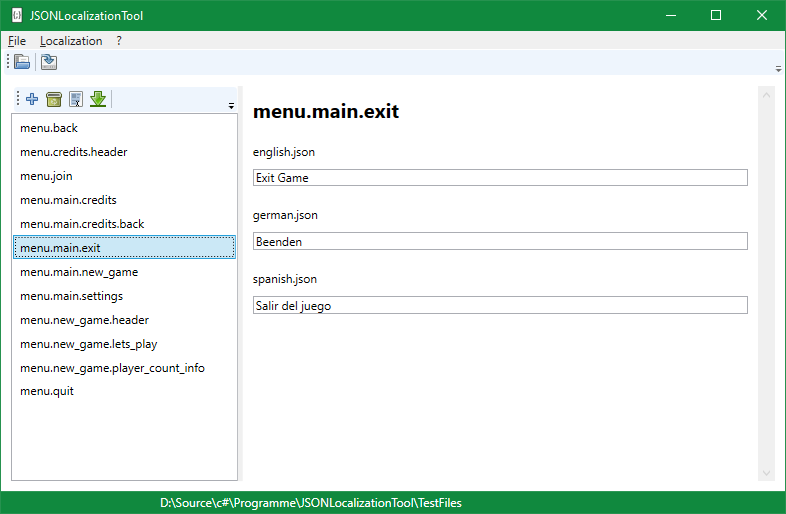

[](https://ci.appveyor.com/project/DerKnob/jsonlocalizationtool/branch/master)

# JSON Localization Tool
I had the need to localize the .json files for my Unity3D project.
It's a quick hack and working for me. But please use with caution. If I find more time, I may add more functions and fix some stuff.

:warning: This software is in alpha state! Please always keep a backup of your files!!!

It lets you open .json files, named by the localization. Then you can maintain the data and save it again. The idea came from the following article on the [Unity Blog](https://learn.unity.com/tutorial/recorded-video-session-localization-tools#5c7f8528edbc2a002053b66a). There you will find examples on how to use the generated .json files in Unity for your localization.


## Install or Build by yourself
### Included Projects
Included projects:
- JSONLocalizationTool
- TestFiles

### Installation File
The [latest Version](https://github.com/DerKnob/JSONLocalizationTool/releases/latest) can be downloaded as installer.

### Checkout & Build
Checkout the project with git. Then open then Visual Studio solution. Go to **Extras->NuGet Package Manager->Package Manager Console** to open the **Package Manager Console**.
Then type this command:
```
Update-Package -reinstall
```
This will reinstall the NuGet dependencies. If you want to setup it manually, have a look at the **3rd Party Libs** list. Now the build should work.

## Screenshots
The UI is not nice but working.




## 3rd Party License
- Newtonsoft.Json
- [Tango Icons](http://tango.freedesktop.org/Tango_Desktop_Project)

## Known Issues
- alot of stuff...